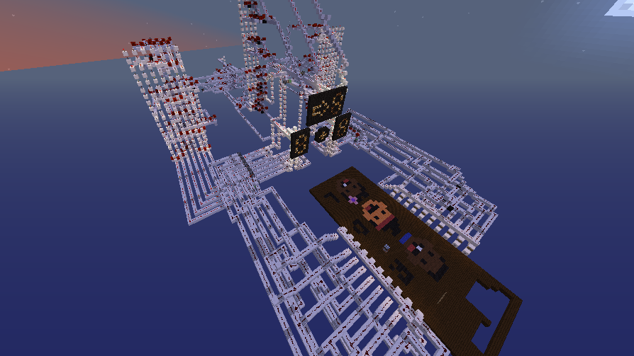

# Somador de números no Minecraft

Este é o mundo do Minecraft que contém a uma máquina de somar números. A máquina é composta por alguns agrupamentos de circuitos de redstone, cada um com sua responsabilidade. A máquina é capaz de somar dois números de 1 a 9, e o resultado é mostrado em um display de 7 segmentos.

## Disclaimers

- O circuito é apenas uma conversão de um circuito que utiliza portas lógicas normais, então pode não ser a maneira mais eficiente e compacta de se fazer isso.

- Não entendo muito com funciona os arquivos de mundo do Minecraft, então enviei todos eles.

## Requisitos

- Minecraft Java Edition 1.7.10+

## Como usar

Para usar a máquina, basta clicar em um dos botões para selecionar um número, e depois clicar em outro botão para selecionar o segundo número. O resultado da soma é mostrado no display de 7 segmentos.

## Como entrar no mundo

- Abra a pasta .minecraft;
- Vá para a pasta saves;
- Clone este repositório dentro desta pasta;
- Renomeie a pasta como desejar;
- Abra o Minecraft e entre no mundo "circuitos".

## Agrupamentos de circuitos

### Input

Este agrupamento é responsável por receber a entrada de dados, que são os números a serem somados. São dez botões, onde cada um representa um número de 0 a 9.

Após o Player clicar em um dos botões a carga passa por um circuito lógico de redstone que converte é responsável por acender o display de 7 segmentos correspondente ao número selecionado.

O estado inicial dos segmentos é ligado, e o circuito lógico é responsável por desligar os segmentos que não devem ser acendidos. Por exemplo, o número 1 é representado pelos segmentos `a` e `b`, e o circuito lógico é responsável por desligar os outros segmentos.

Para que os segmentos sejam desligados, é necessário que os pistões empurrem os blocos de redstone correspondentes para baixo. Os pistões são acionados por um circuito de redstone que é acionado quando o Player clica em um dos botões.

Como são dois displays, há dois circuitos de redstone, um para cada display. Cada circuito é responsável por acender o display correspondente.

### Decoder

Este agrupamento é responsável por decodificar o número selecionado pelo Player. O número selecionado é representado por um display de 7 segmentos, e o agrupamento é responsável por converter o número em um código binário de 4 bits.

Como há dois displays, há dois decoders, um para cada display. Cada decoder é responsável por decodificar o número selecionado pelo Player no display correspondente.

### Somador

Este agrupamento é responsável por somar os dois números selecionados pelo Player. O agrupamento é composto por dois decoders, um para cada número, e um circuito de redstone que realiza a soma.

### Encoder

Este agrupamento é responsável por codificar o resultado da soma de volta para um display de 7 segmentos. O agrupamento é composto por um circuito de redstone que realiza a codificação, e um display de 7 segmentos.

### Overflow

Caso a soma dos números seja maior que 9, o resultado é mostrado no display de 7 segmentos com um erro.

Para isso é necessário apenas uma verificação simples, se o número de 4 bits da soma for maior que 9 ou se o seu carry out estiver ligado, então o resultado é mostrado com um erro.

